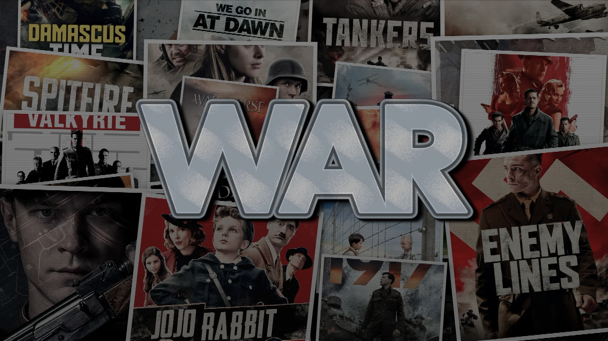
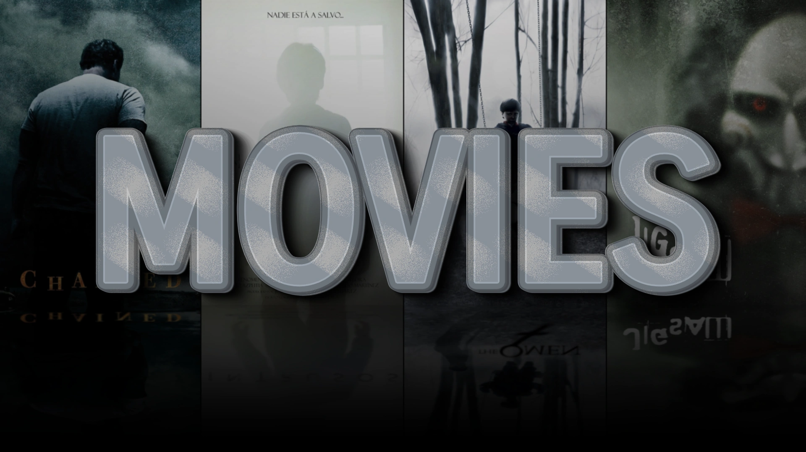
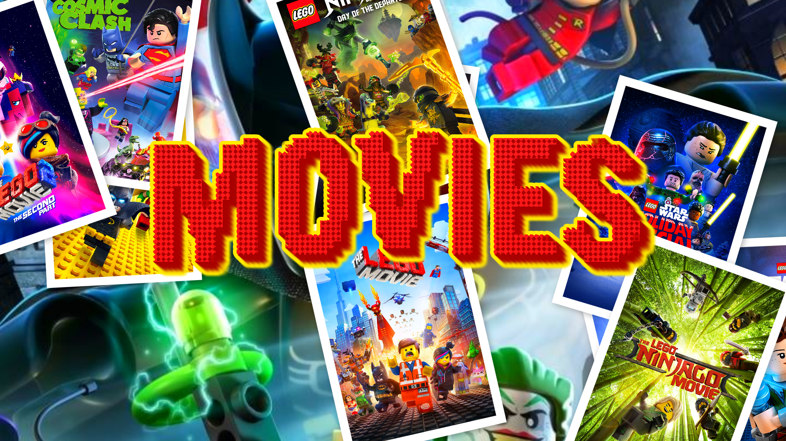
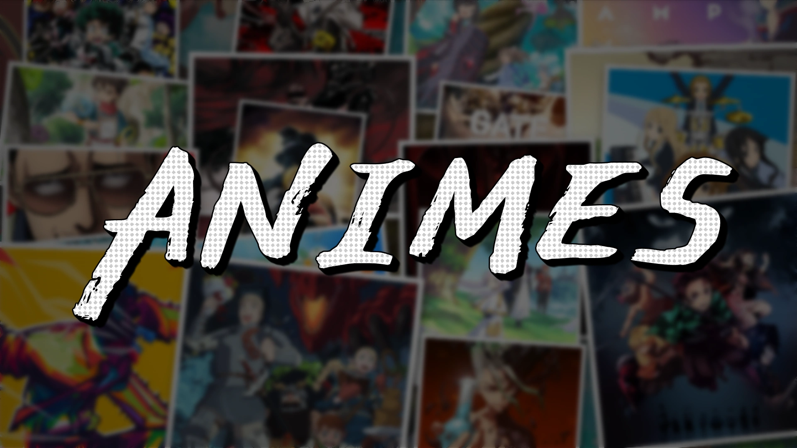
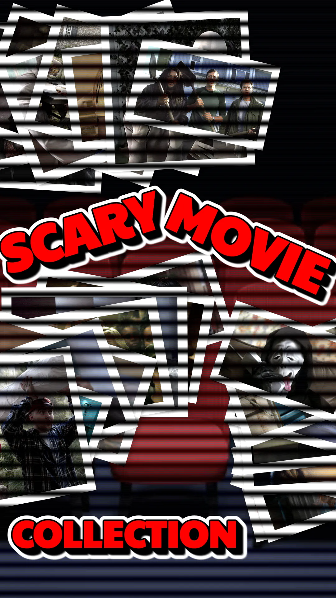

# Community Gallery

This file is auto-generated from the `gallery/gallery.json` file.

Generated: 2025-12-01T21:15:29.611Z

## Projects (5)

Cover (4)

  

  

    War — Metal
  

  

    A high-contrast metallic poster featuring stacked text, long shadow, and distress effects.
  

  

    Author:
    <a href="https://github.com/jeffersoncgo/CoverMaker" target="_blank">jeffersoncgo</a>
  

  

    <a href="gallery/projects/war-metal/project.json">Setup</a>
    <a href="gallery/projects/war-metal/war.metal.project.zip">Project</a>
  

  

  

    Movies — Metal
  

  

    Rustic metallic style perfect for action and drama collections, with subtle distress and strong typography.
  

  

    Author:
    <a href="https://github.com/jeffersoncgo/CoverMaker" target="_blank">jeffersoncgo</a>
  

  

    <a href="gallery/projects/movies-metal/project.json">Setup</a>
    <a href="gallery/projects/movies-metal/movies.metal.project.zip">Project</a>
  

  

  

    Lego — Movies
  

  

    A playful, colorful collage inspired by Lego aesthetics, great for family-friendly collections.
  

  

    Author:
    <a href="https://github.com/jeffersoncgo/CoverMaker" target="_blank">jeffersoncgo</a>
  

  

    <a href="gallery/projects/movies-lego/project.json">Setup</a>
    <a href="gallery/projects/movies-lego/movies.lego.project.zip">Project</a>
  

  

  

    Animes — Manga
  

  

    Manga-style imagery and high-contrast text, tuned for animated and illustrated collections.
  

  

    Author:
    <a href="https://github.com/jeffersoncgo/CoverMaker" target="_blank">jeffersoncgo</a>
  

  

    <a href="gallery/projects/animes-manga/project.json">Setup</a>
    <a href="gallery/projects/animes-manga/animes.manga.project.zip">Project</a>
  

Poster (1)

  

  

    Scary Movie Collection — Deep Shadow
  

  

    Moody, cinematic horror collection with deep shadows and dramatic tones.
  

  

    Author:
    <a href="https://github.com/jeffersoncgo/CoverMaker" target="_blank">jeffersoncgo</a>
  

  

    <a href="gallery/projects/scary-collection/project.json">Setup</a>
    <a href="gallery/projects/scary-collection/scary-movie-collection.deepshadow.project.zip">Project</a>
  

## Contributing

