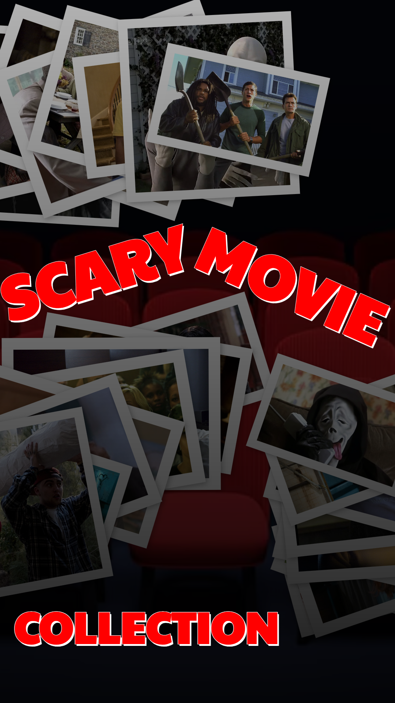
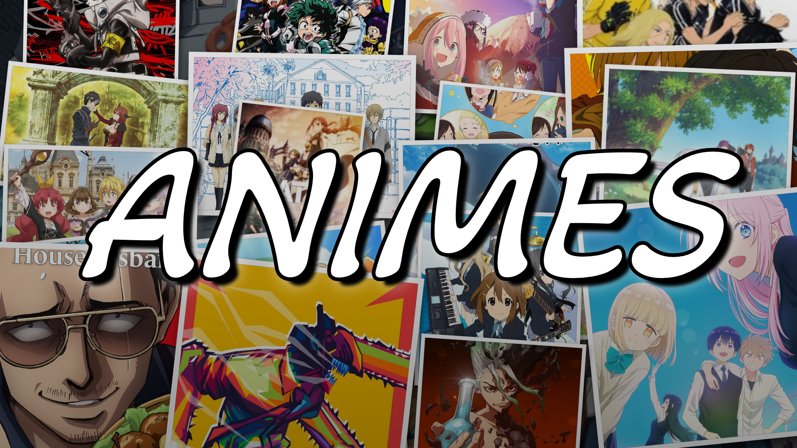

# 🎬 CoverMaker

**A High-Performance, Client-Side Poster Design Tool for Jellyfin Media Collections**

---

## 🌐 Try It Online

**[Launch CoverMaker →](https://jeffersoncgo.github.io/CoverMaker/)**

No installation required! Open the link and start creating stunning collection posters immediately in your browser.

---

## 🧩 Overview

**CoverMaker** is a sophisticated web-based canvas tool designed for creating custom collection posters for Jellyfin media servers. Built with pure vanilla JavaScript and modern browser APIs, it provides real-time poster composition with advanced text effects, multiple layout engines, per-image filters, and seamless Jellyfin integration.

The application runs entirely in the browser with **zero build tools** required. Features OffscreenCanvas rendering for performance, IndexedDB for persistent caching, and optional Meilisearch integration for fast library searches.

### ✨ Key Features

- **🎨 Advanced Canvas Rendering**: Real-time poster generation with OffscreenCanvas
- **📚 Jellyfin Integration**: Direct server authentication and library browsing
- **🔍 Intelligent Search**: Dual-mode search with Meilisearch auto-detection
- **✏️ Multi-Layer Text System**: Unlimited text layers with 3D effects, gradients, strokes, and shadows
- **🖼️ Per-Image Filters**: Individual transform, rotation, and scale for each image
- **🎭 18 Layout Modes**: Line, Grid, Mosaic, Circle, Collage, Italic Line, Carousel, Fan Spread, Scattered Stack, Spiral, Waves, Book Stack, Polaroid Wall, Shrink, Scattered Photos, Card Fan, Mondrian's Grid, and Framed Grid
- **🎨 Custom Backgrounds**: Solid colors and gradient overlays
- **💾 Project Management**: Save/load complete projects as JSON files
- **🎯 Drag & Drop**: Intuitive slot management with reordering and pin protection
- **🌐 No Backend Required**: Fully client-side with localStorage and IndexedDB persistence

---

## 🚀 Quick Start

1. **[Open CoverMaker](https://jeffersoncgo.github.io/CoverMaker/)** in your browser
2. **Add Image Slots**: Click the `+` button to add poster positions
3. **Load Images**:
   - **From Jellyfin**: Login and browse your media library
   - **From Local Files**: Click the folder icon on any slot to upload
   - **Via Drag & Drop**: Drop images directly onto slots
4. **Choose Layout**: Select from 18 different layout modes (Settings tab)
5. **Add Text**: Create text layers with advanced effects
6. **Export**: Download as PNG/JPEG or save project for later editing

### Jellyfin Integration

The app seamlessly connects to your Jellyfin server:
- Automatic server authentication with credential persistence
- Meilisearch plugin auto-detection for fast library search
- IndexedDB caching for instant offline access
- Smart incremental updates when your library changes
- Advanced filtering by tags, genres, studios, ratings, and years

---

## 🎨 Gallery & Examples

See what you can create with CoverMaker! Each example includes a downloadable project file.

### Example 1: Line Layout - Film Collection

**Features Used:** Line layout mode, reflection effects, gradient overlay, custom text positioning

📦 **[Download Project](images/demo/cover_line_filmes_project.zip)** | 🖼️ **[View Result](images/demo/cover_line_filmes_app.png)**

---

### Example 2: Collage Layout - Scary Movie Collection

**Features Used:** Collage layout, scattered positioning, individual image transforms, creative text effects

📦 **[Download Project](images/demo/poster_scatared-photos_collecion-scary-movie_project.zip)** | 🖼️ **[View Result](images/demo/poster_scatared-photos_collecion-scary-movie_app.png)**

---

### Example 3: Collage Layout - Anime Collection

**Features Used:** Collage arrangement, multiple text layers with 3D effects, gradient backgrounds

📦 **[Download Project](images/demo/cover_collage_animes_project.zip)** | 🖼️ **[View Result](images/demo/cover_collage_animes_app.png)**

---

### 🎨 Share Your Creations!

We'd love to see what you create with CoverMaker! If you design posters or covers you're proud of, please share them with the community.

**How to contribute to the gallery:**
1. Create your design and export the final image (PNG or JPG)
2. Export your project as a ZIP file (use the export feature in the app)
3. [Open an issue](https://github.com/jeffersoncgo/CoverMaker/issues/new) or [submit a pull request](https://github.com/jeffersoncgo/CoverMaker/pulls) including:
   - Your final image file
   - Your project ZIP file
   - Brief description of your collection (optional)

Your examples will be featured here and help inspire other users!

---

## 🎭 Layout Modes

CoverMaker offers 18 distinct layout algorithms to arrange your images:

### **Line**
Arranges images in a horizontal or vertical line with optional reflection effects. Perfect for classic collection banners with professional reflections. Images are evenly spaced with customizable reflection distance (0-1) and scale (0-1).

### **Grid**
Intelligently distributes images in an optimal grid pattern. Automatically calculates the best row/column arrangement based on canvas aspect ratio and number of images. Ideal for large collections.

### **Mosaic**
Creates professional mosaic arrangements using Binary Space Partitioning for 100% canvas coverage. Images are arranged in varied sizes with deterministic randomization based on salt value. Features polaroid-style white borders and subtle rotations.

### **Circle**
Arranges images in a circular "pizza slice" pattern. Single images appear as circles; multiple images create pie chart style compositions. Each slice fills its wedge section perfectly.

### **Collage**
Scatters images with varied sizes and positions. First image serves as full background, remaining images arranged in grid-based positions with random scatter. Features polaroid-style frames with shadows and rotations for scrapbook aesthetic.

### **Italic Line**
Line layout with adjustable skew angle (controlled by salt 0-720). Creates dynamic slanted arrangements with properly aligned reflections. Maintains all line layout features (reflections, spacing, blur) while adding perspective tilt.

### **Carousel**
3D carousel effect with first image as background. Remaining images rotate in elliptical pattern with perspective scaling (closer = larger). Features depth-based shadows and opacity. Salt value controls rotation offset.

### **Fan Spread**
Cards spread in fan pattern from center. First image as background, remaining cards arranged in arc with increasing opacity toward front. Lateral offset and vertical wave pattern controlled by salt. Maximum spread angle: 20-50 degrees based on count.

### **Scattered Stack**
Book-like stack with controlled scatter. First image fills canvas as background, remaining cards stack with size reduction per layer (3% per card). Position and rotation influenced by salt for deterministic randomization.

### **Spiral**
Images arranged in logarithmic spiral from center outward. First image as background, remaining images follow spiral path with decreasing size. Spiral tightness (0.15-0.30) and rotation speed (2.5-4.5 rotations) controlled by salt.

### **Waves**
Wave pattern arrangement with first image as background. Remaining images alternate left-right positions while following sinusoidal wave path. Wave frequency (1.5-3 waves) and amplitude (8-20% of width) controlled by salt.

### **Book Stack**
Physical stacking grid with 30% overlap. Calculates optimal rows/columns based on canvas ratio. Portrait aspect (0.70) with rounded corners and shadows. Subtle rotations per poster influenced by salt. Maximizes canvas coverage.

### **Polaroid Wall**
Scattered polaroid-style photos on textured background. First image as darkened background, remaining images in grid-based positions with organic scatter. Features tape pieces (top or corner, chosen by salt), realistic shadows, and varied rotations.

### **Shrink**
Concentric layers shrinking toward center. Each layer 85% of previous (15% reduction ensures 20%+ of previous layer visible). No salt influence—pure geometric progression. Front layers have scaled shadows and optional white borders.

### **Scattered Photos**
First image fills canvas as background, remaining images scattered as polaroid-style photos. Deterministic randomization based on salt controls position, rotation, and scale. Features white borders, realistic shadows, and varied aspect ratios (portrait, square, landscape).

### **Card Fan**
Playing card fan spread effect. First image as background, remaining cards arranged in arc from bottom-center. Features depth-based opacity, progressive shadows, and smooth rotation spread. Maximum angle controlled by card count.

### **Mondrian's Grid**
Inspired by Piet Mondrian's compositions. Creates artistic grid with varied rectangle sizes using Binary Space Partitioning. Each region filled with solid color or image. Salt controls split ratios and color selection for geometric variety.

### **Framed Grid**
Professional gallery-style grid with thick white frames. Portrait orientation (2:3 aspect) with consistent spacing. Calculates optimal rows/columns based on canvas ratio. Features subtle shadows and clean borders for museum-quality presentation.

---

## ⚙️ Configuration Options

### Canvas Settings

**Aspect Ratio Options:**
- **Cover** (16:9): Wide horizontal format, perfect for collection banners
- **Poster** (9:16): Vertical format, ideal for movie/series posters  
- **Square** (1:1): Balanced format for social media
- **Custom**: Define any dimensions (width/height in pixels)

**Salt Value:**
- Controls deterministic randomization in applicable layouts
- Range: 1+ (affects positioning, rotation, scatter patterns)

**Base Scale:**
- Controls overall image sizing within layout
- Range: 0.1-10 (default 1.4)

**Effects (Line/Italic Line layouts only):**
- **Blur Amount**: 0-100 (default 5)
- **Reflection Distance**: 0-1 (default 0.8)
- **Reflection Scale**: 0-1 (default 0.7)

**Overlay:**
- Start Color & Opacity (0-1, default 0.5)
- End Color & Opacity (0-1, default 0.9)

**Export:**
- Format: PNG or JPEG
- JPEG Quality: 0-1 (default 1.0)

---

### Text Layer Effects

Create unlimited text layers with professional typography:

**Basic Settings:**
- 800+ Google Fonts available
- Custom font size, weight, and style
- Color with opacity control (0-1, default 0.8)
- Position and alignment controls

**Stroke/Outline:**
- Width: 1+ pixels (default 2)
- Custom color
- Opacity: 0-1 (default 1.0)

**Shadow Effects:**
- Blur radius: 0+ (default 5)
- X and Y offset controls
- Custom shadow color

---

## 🧠 Current Features

**Core Rendering:**
- ✅ OffscreenCanvas rendering for non-blocking UI
- ✅ 18 unique layout algorithms
- ✅ Custom canvas dimensions and aspect ratios
- ✅ PNG and JPEG export with quality control

**Text System:**
- ✅ Unlimited independent text layers
- ✅ 800+ Google Fonts with async loading
- ✅ Multiple strokes and shadows per layer
- ✅ Layer visibility toggle
- ✅ Custom positioning and rotation

**Image Management:**
- ✅ Unlimited image slots with drag-and-drop reordering
- ✅ Pin protection to lock specific images
- ✅ Random image selection from library
- ✅ Loading placeholders and error handling

**Jellyfin Integration:**
- ✅ Server authentication with fastest-address auto-detection
- ✅ Multiple library support with metadata caching
- ✅ IndexedDB persistent cache for offline access
- ✅ Incremental cache updates (delta sync)
- ✅ Meilisearch plugin auto-detection
- ✅ Advanced search filters (tags, genres, studios, ratings, years)
- ✅ Pagination with configurable page size

**Project Management:**
- ✅ Complete project save/load as JSON files
- ✅ Automatic localStorage persistence for settings
- ✅ Session restore on page reload

**User Interface:**
- ✅ Tabbed interface with responsive design
- ✅ Draggable floating windows
- ✅ Toast notifications
- ✅ Real-time preview updates
- ✅ Collapsible sections

---

## 🧱 Technical Architecture

### Technology Stack

**Core Technologies:**
- Pure Vanilla JavaScript (ES6+)
- HTML5 Canvas API with OffscreenCanvas
- CSS3 with Grid and Flexbox
- IndexedDB for data caching
- localStorage for preferences

**External Integrations:**
- Jellyfin Server API (optional)
- Meilisearch Plugin (optional)
- Google Fonts API

### Performance

**Rendering:**
- OffscreenCanvas prevents UI thread blocking
- Incremental redraw pipeline
- Image preprocessing and caching

**Data Management:**
- IndexedDB stores 50MB+ of library metadata
- Smart delta sync for library updates
- Debounced search prevents redundant API calls

---

## 🌐 Browser Compatibility

| Browser | Version | Status |
|---------|---------|--------|
| Chrome | 90+ | ✅ Full Support |
| Firefox | 88+ | ✅ Full Support |
| Safari | 14.1+ | ✅ Full Support |
| Edge | 90+ | ✅ Full Support |
| IE 11 | - | ❌ Not Supported |

**Required APIs:** Canvas, OffscreenCanvas, Fetch, IndexedDB, localStorage

---

## 🐛 Troubleshooting

### Connection Issues

**"Cannot connect to Jellyfin server"**
- Verify server URL is correct (include port: `http://192.168.1.100:8096`)
- Check Jellyfin server is online and accessible
- For HTTPS, ensure valid SSL certificate

**"CORS or network error"**
- Access via online URL or local HTTP server (not `file://` protocol)

### Library & Search

**"Library not loading"**
- First login takes 10-30 seconds to cache metadata
- Clear browser cache/IndexedDB and retry
- Check browser console (F12) for errors

**"Images not displaying"**
- Verify images exist in Jellyfin library
- Try refresh icon on slot
- Check image permissions in Jellyfin

### Rendering

**"Canvas not updating"**
- Click canvas to trigger manual refresh

**"Text not visible"**
- Check layer visibility (eye icon)
- Verify opacity is not 0
- Ensure text color contrasts with background

### Export

**"Downloaded image is blank"**
- Ensure at least one image is loaded before exporting

**"Export quality is low"**
- Adjust quality in Settings → Export Options

### Performance

**"App is slow or laggy"**
- Reduce number of text layers
- Use simpler layout modes
- Reduce canvas dimensions
- Close other browser tabs

---

## 📄 License

MIT License - See [LICENSE](LICENSE) for details

---

## 🙏 Contributing

Contributions welcome! Areas of interest:
- Performance optimizations
- UI/UX improvements
- New layout algorithms
- Jellyfin API extensions

---

## 💬 Support & Issues

📧 **GitHub Issues:** [Report bugs here](https://github.com/jeffersoncgo/CoverMaker/issues)

---

**Made with ❤️ for Jellyfin enthusiasts**
