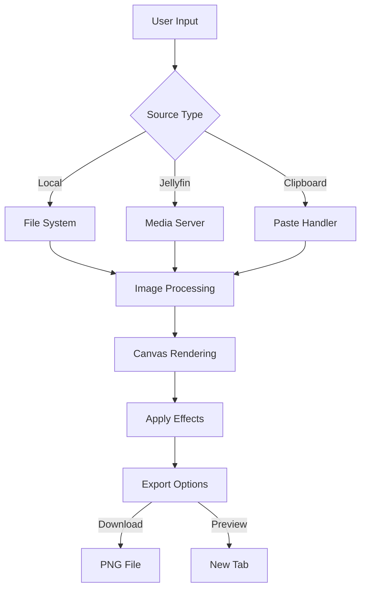

# Collection Cover Maker 🎨

Create stunning covers for your media collections with this web-based tool that allows you to design and generate custom composite images. Perfect for organizing movies, TV shows, and more!

🔗 **Live Demo**: [Try it now!](https://jeffersoncgo.github.io/CoverMaker/)

## Examples
<details>
  <summary>Spoiler: Page</summary>


</details>
<details>
  <summary>Spoiler: Covers Examples</summary>


</details>

## 📖 Overview

Collection Cover Maker is an intuitive web application that helps you create professional-looking cover images for your media collections. Whether you're organizing movies, TV shows, or music, this tool provides a wide range of customization options and seamless integration with Jellyfin media server.

## ✨ Features

### 🎯 Core Features
- **Create Composite Images**: Combine multiple images into a single stunning cover
- **Real-time Preview**: See your changes instantly in the canvas preview
- **Export Options**: Download as PNG or open in a new tab
- **Flexible Image Sources**:
  - Local computer files
  - Drag and drop support
  - Clipboard paste functionality
  - Jellyfin media library integration

### 🛠️ Image Management
- **Multiple Image Slots**:
  - Add/remove slots dynamically
  - Pin images to prevent changes
  - Move images between slots
  - Clear individual slots
  - Random image selection
- **Drag & Drop Support**:
  - Reorder images between slots
  - Import from local files
  - Move covers from Jellyfin panel

### 🎨 Customization Options
- **Text Overlay**:
  - Custom text
  - Font selection
  - Size adjustment
  - Color picker
  - Bold option
  - Opacity control
- **Image Layout**:
  - Adjustable margins
  - Reflection effects
  - Blur control
  - Scale settings
  - Global overlay opacity

### 🔌 Jellyfin Integration
- **Server Connection**:
  - Secure authentication
  - Library browsing
  - Image search
  - Fast loading with MeiliSearch support
- **Library Management**:
  - Browse all libraries
  - Search functionality
  - Random image selection
  - Pagination controls
  - Adjustable results limit

## 🚀 Getting Started

### Online Version
Visit [https://jeffersoncgo.github.io/CoverMaker/](https://jeffersoncgo.github.io/CoverMaker/) to use the tool directly in your browser.

### Local Installation
1. Clone the repository:
   ```bash
   git clone https://github.com/jeffersoncgo/CoverMaker.git
   ```
2. Open `index.html` in your web browser
3. Start creating your covers!

## 🛠️ Usage

### Basic Usage
1. **Start Creating**:
   - Add image slots using the '+' button
   - Import images through:
     - Local file selection
     - Drag and drop
     - Clipboard paste
     - Jellyfin library (if connected)

2. **Customize Your Cover**:
   - Arrange images by dragging
   - Add text overlay
   - Adjust visual effects
   - Fine-tune layout settings

3. **Export Your Work**:
   - Download as PNG
   - Preview in new tab
   - Use in your media collection

### Jellyfin Integration
1. **Connect to Jellyfin**:
   - Click "Login to Jellyfin"
   - Enter server details
   - Provide credentials

2. **Browse Your Library**:
   - Select a library
   - Search for media
   - Use filters and sorting
   - Set display limits

3. **Use Media Covers**:
   - Click to add to slots
   - Drag to specific positions
   - Use random selection

## 📦 Technologies

- **Frontend**:
  - HTML5
  - CSS3
  - JavaScript (ES6+)
  - Canvas API
  - Drag and Drop API
  - File API

- **Jellyfin Integration**:
  - Jellyfin API
  - MeiliSearch support
  - Async/await pattern
  - REST API integration

## 🔧 Configuration

### Appearance Settings
- Font styles and sizes
- Color schemes
- Shadow effects
- Layout dimensions

### Performance Options
- Image loading strategies
- Caching mechanisms
- MeiliSearch optimization

## ✅ Requirements

- Modern web browser with JavaScript enabled
- Internet connection for Jellyfin integration
- (Optional) Jellyfin server for media library access

## 🤝 Contributing

1. Fork the repository
2. Create a new branch
3. Make your changes
4. Submit a pull request

## 📄 Documentation

- Project structure follows standard web conventions
- Code is extensively commented
- Modular architecture for easy maintenance
- Event-driven design for user interactions

## ❤️ Acknowledgements

- [Jellyfin](https://jellyfin.org/) for media server integration
- [MeiliSearch](https://www.meilisearch.com/) for fast search capabilities
- [Font Awesome](https://fontawesome.com/) for icons

## 🗂️ Repository Structure

```
CoverMaker/
├── css/
│   └── style.css           # Main stylesheet
├── images/                 # Image assets
├── js/
│   ├── jellyfin.js        # Jellyfin integration
│   ├── script.js          # Main application logic
│   ├── windowsHandle.js   # Window management
│   └── vendor/            # Third-party libraries
├── index.html             # Main application entry
└── README.md             # Project documentation
```

## 🔗 Flow Chart



---

📝 Last updated: November 7, 2025
